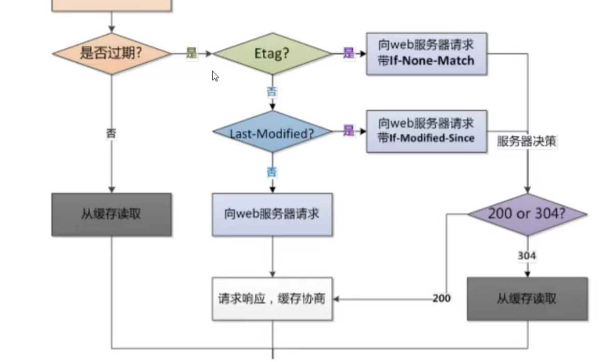

# HTTP 缓存机制

### HTTP 缓存机制

HTTP 缓存机制是一种用于在客户端和服务器之间减少数据传输的策略，它可以通过将一些资源（如文本、图像、样式表等）存储在客户端或中间代理服务器上，以便在后续请求中可以更快地获取这些资源。HTTP 缓存机制有助于提高网站性能和减少网络流量。

`Cache-Control` 是 HTTP 头部的一个字段，它可以用来指定资源的缓存策略。`Cache-Control` 头部中的不同指令可以控制缓存的行为。其中，`no-store` 和 `no-cache` 是两个常用的指令，它们有一些区别：

1. **no-store**：

   `Cache-Control: no-store` 指令表示不允许缓存服务器或客户端存储任何关于请求/响应的内容。这意味着每次请求都要直接与服务器进行交互，无法使用本地缓存或代理服务器缓存。这个指令适用于敏感信息，如个人身份信息或银行账户等，以确保数据不会被保存在缓存中，从而增加安全性。

2. **no-cache**：

   `Cache-Control: no-cache` 指令表示可以缓存内容，但在使用之前需要向服务器验证资源是否仍然有效。即使缓存中有资源的副本，客户端或代理服务器在使用之前都必须向服务器发送请求以验证资源的有效性。如果资源仍然有效，服务器将返回一个 304 Not Modified 响应，告诉客户端使用缓存的版本。这个指令适用于需要频繁验证资源的情况，以确保获取的是最新的版本。

**状态码 304 表示协商缓存**

默认情况下，浏览器的缓存策略会根据响应的 HTTP 头部信息来决定是否缓存资源以及缓存的方式。浏览器根据响应的头部信息中的 `Cache-Control`、`Expires`、`ETag` 等字段来判断是否应该缓存资源以及如何使用缓存。以下是一些常见的默认行为：

1. **Cache-Control: public**： 如果服务器在响应中设置了 `Cache-Control: public`，表示资源可以被公共缓存（包括浏览器缓存和代理服务器缓存）。这通常适用于不包含敏感信息的资源，如静态文件、图像等。
2. **Cache-Control: private**： 如果服务器在响应中设置了 `Cache-Control: private`，**表示资源只能被客户端缓存，而不能被代理服务器缓存**。这适用于包含用户**个人信息的资源**，防止敏感信息被代理服务器缓存。
3. **Cache-Control: no-cache**： 如果服务器设置了 `Cache-Control: no-cache`，表示浏览器可以缓存资源，但**在使用之前需要向服务器验证资源是否仍然有效**。这会导致浏览器每次请求都会向服务器发送请求，以验证资源的有效性。
4. **Expires 头部**： 如果响应中包含了 `Expires` 头部，它指定了资源过期的日期和时间。浏览器会比较当前时间和过期时间，如果资源还未过期，浏览器就会使用缓存的版本。然而，`Expires` 头部不是很灵活，因为它依赖于服务器和客户端时间的同步。

#### 客户端缓存和服务端缓存

- **资源的动态性：** 如果资源经常变化，客户端缓存可能无法始终提供最新的内容，此时服务端缓存可能更合适。
- **用户体验：** 对于需要快速响应的用户操作，客户端缓存能够提供更快的加载速度。
- **服务器负载：** 如果服务器处理大量请求并且资源计算密集，服务端缓存可以减轻服务器负载。
- **缓存有效性管理：** 需要注意及时更新客户端和服务端缓存，确保缓存的数据始终准确。

Expires: response header 里的过期时间，浏览器再次加载资源时，如果在这个过期时间内，则命中强缓仔 Cache-Control: 当值设为 max-age=300 时，则代表在这个请求正确返回时间 (浏览器也会记录下来)的 5 分钟内再次加载资源，就会命中强缓存。
cache-control 除了该字段外，还有下面几个比较常用的设置值:
-no-cache: 不使用本地缓存。需要使用缓存协商，先与服务器确认返回的响应是否被更改，如果之前的响应中存
在 ETag，那么请求的时候会与服务端验证，如果资源未被更改，则可以避免重新下载.-no-store: 直接禁止浏览器缓存数据，每次用户请求该资源，都会向服务器发送一个请求，每次都会下载完整的资源。
-public: 可以被所有的用户缓存，包括终端用户和 CDN 等中间代理服务器
-private: 只能被终端用户的浏览器缓存，不允许 CDN 等中继缓存服务器对其缓存.
Expires:设置以分钟为单位的绝对过期时间,设置相对过期时间,max-age 指明以秒为单位的缓存时

### 浏览器缓存过程

1 浏览器第一次加载资源，服务器返回 200，浏览器将资源文件从服务器上请求下载下来，并把 response header 及该请求的返回时间一并缓存;

2.下一次加载资源时，先比较当前时间和上一次返回 200 时的时间差，如果没有超过 cache-control 设置的 max-age，则没有过期，命中强缓存，不发请求直接从本地缓存读取该文件(如果浏览器不支持 HTTP1.1，则用 expires 判断是否过期);如果时间过期，则向服务器发送 header 带有 lf-None-Match 和 lf-Modified-Since 的请求

3.服务器收到请求后，优先根据 Etag 的值与 lf-None-Match 比较，判断被请求的文件有没有做修改，Etag 值一致则没有修改，命中协商缓存，返回 304;如果不一致则有改动，直接返回新的资源文件带上新的 Etag 值并返回 200;

4.如果服务器收到的请求没有 Etag 值，则将 If-Modified-Since 和被请求文件的最后修改时间做比对商缓存，返回 304;不一致则返回新的 last-modified 和文件并返回 200;
