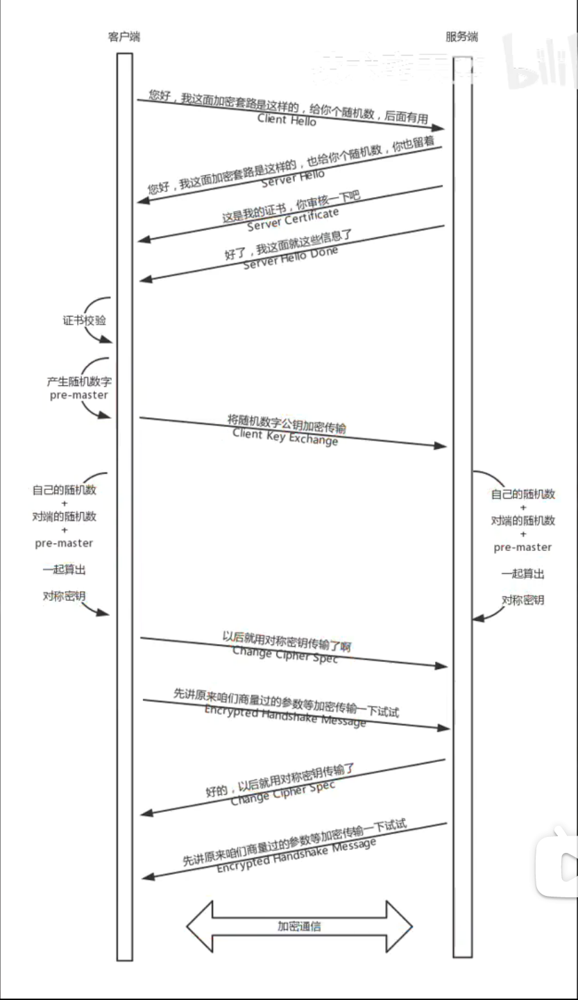

# HTTPS 原理

## SSL 证书

我们在访问浏览器的时候有时候会出现“你的连接不是专用连接”、或者“此站点的连接不安全”等情况，我们知道这是因为访问的站点是**http**而不是**https**，而浏览器识别后会显示不安全的情况。而 https 和 http 的区别主要在于有没有配置 ssl 证书，且有无加密，在服务器运营商那边配置了**ssl 证书**之后(会把 HTTP 默认端口:80 改为 HTTPS 默认端口:443)，将域名解析可以变成 https。而这背后的原理是怎么样的呢？

首先正常的 TCP 三次握手是不变的。详情见之前的文章

访问一个站点时，中间可能经过若干个中间节点（路由器转发数据包），很难保证中间是否存在窃听甚至篡改数据的中间者。http 协议本身并未涉及安全问题，是用明文形式传输。

此时我们可以想想能否**直接使用对称加密**？对称加密的前提是要通信双方互相都有相同的对称密钥明文，通讯过程中由一方生成对称密钥的明文，再传输这显然是不现实的，因为对称密钥明文可能会被攻击者拦截。

**不可抵赖性**（不可篡改）：服务端将文件进行哈希加密后的密文（**签名**）用私钥加密；再将文件和密文都传过去； 自己用服务端的公钥解密，然后再对文件进行哈希，对比哈希后的密文，确定文件内容未被篡改。

那如何获取到目标网站的公钥呢，进行 https 通信时，需要对方把公钥发给自己，但此时若是途径中间节点处，被篡改者调换成自己的公钥，然后用自己的私钥解密，则窃取了传输内容（接收方无法得知公钥是谁的）
因此需要**CA 机构**，CA 机构用自己的私钥加密后传给服务器,这样附带有 CA 信息的密钥就没办法被中间篡改了。
**CA 机构**有多级，操作系统中内置了最高级的 CA 机构，因此 CA 认证时会一级一级的认证（PKI 证书体系），最高级的 CA 机构会被用户信任。

RSA 加密后，接下来的通讯是通过对称加密通信。

总体的 HTTPS 原理如下图：
客户端和服务端给对方传送一段随机数(client/server hello)以及确认 http 版本号（以保证生成的密钥不会每次都一样），再加上证书校验后客户端生成一个新的随机数 pre-master 三部分形成对称密钥，用服务器公钥加密后传回给服务器。 (服务器发生完证书还要告诉客户端 server hello done)
通讯后推导出 Session Key 用于对称加密进行通讯
（图片源自网络）

[参考视频 1](https://www.bilibili.com/video/BV11R4y1Y75L)

[参考视频 2](https://www.bilibili.com/video/BV1uY4y1D7Ng)
视频里面说，CA 机构（不够被信任）加密后仍需向日志服务（受所有 CA 机构和服务端监督）提交证书详情，返回 SCT 数据，附带 SCT 数据的证书返回给服务端。服务端传输到客户端后，客户端会通过使用日志服务的公钥对 SCT 签名数据验证。（简而言之就是套了一层，不过此时是日志服务更权威）
CT 机制日志信息记录所有的证书数据字符串，通过 Merkle tree 转为一段字符串，以确保信息不被篡改，达到去中心化。

## DES 加密

通过对**对称密钥**进行异或实现
**DES**是一种将 64 比特的明文加密成 64 比特的密文的对称密码算法，它的密钥长度是 56 比特。转换为 56 位，2^56，容易被破解。
**3DES**
是为了增加 DES 的强度，将 DES 重复 3 次（加密-解密-加密）所得到的一种密码算法
由于 DES 密钥的长度实质上是 56 比特，因此三重 DES 的密钥长度就是 56×3=168 比特, 加上用于错误检测的标志位 8x3, 共 192bit. 标准三重 DES 只会使用两个密钥所以 DES 密钥长度是 56x2 + 8x2=128

**AES 加密**，分组长度为 128 比特，密钥长度可以以 32 比特为单位在 128 比特到 256 比特的范围内进行选择（不过在 AES 的规格中，密钥长度只有 128、192 和 256 比特三种）。
参考文章：[https://blog.csdn.net/AtlanSI/article/details/110631873]
