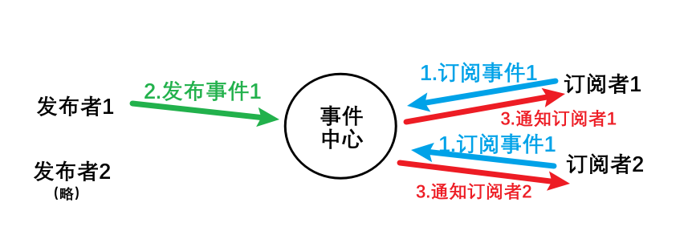

## 观察者模式vs发布订阅模式


### 引入——有趣的小案例

当我们加入一个发放各种优惠券的群时，我们进入了**观察者模式**的世界。这个群就像一个精彩的**主题**，而我们作为群成员，其实就是**观察者**。每天我们都收到一大堆群消息，有关衣服、零食等优惠券。

过段时间，我厌烦了这源源不断的群消息，于是我直接退群了。但我并不希望错过所有的优惠，因此与**群主**进行了私下的交流，我只对洗衣液的优惠券感兴趣，让群主以后有洗衣液的优惠券私发给我。

这样，从观察者模式进化到了**发布订阅模式**。现在，我只**订阅**了我真正关心的优惠券——洗衣液，过滤掉了其他不感兴趣的优惠券。**群主**成为了**我**与这个**丰富主题**之间的**中间人**，只有当有洗衣液的优惠券时，才会私下发送给我。


### 发布订阅模式

#### 含义

> **发布-订阅**是软件架构中的一种`消息范式`，**消息的发布者不会将消息直接发送给特定的订阅者。**而是将发布的消息分为不同的类别，无需了解哪些订阅者（如果有的话）可能存在。同样的，订阅者可以表达对一个或多个类别的兴趣，只接收感兴趣的消息，无需了解哪些发布者（如果有的话）存在。

**订阅者把自己想要订阅的事件注册到事件中心，当发布者发布事件到事件中心，由事件中心统一调度订阅者注册到调度中心的处理代码。**

#### 一次订阅发布的流程

**发布者->事件中心<=>订阅者**

订阅者需要向事件中心订阅指定的事件 -> 发布者向事件中心发布指定事件内容 -> 事件中心通知订阅者 -> 订阅者收到消息（可能是多个订阅者）。



#### 代码

`EventEmitter`类中，

- 构造函数初始化一个空对象`this.events`，用于存储事件名及它们的回调。

- 定义`on(eventName,callback)`，用于订阅事件。

  - 若事件名不存在（没有订阅者订阅过），则`this.events[eventName] = [callback];`

  ```
  //events的结构
  events:{
  	eventName:[f]
  }
  ```

  - 若事件名存在（有人订阅过，存在其他回调函数），则`this.events[eventName].push(callback);`

  ```
  //events的结构
  events:{
  	eventName:[f,f]//（一个事件可以有很多回调函数，相当于多个订阅者）
  }
  ```

- 定义`emit(eventName, ...args)`，用于发布事件。若事件名存在，则遍历与事件名相关联的回调函数数组，依次执行这些回调函数，并传递可选参数`args`给它们。

- 定义`off(eventName, callback)`，用于取消订阅事件。若事件名存在，则遍历与事件名相关联的回调函数数组，找到并移除某个回调函数`callback`。

```javascript
class EventEmitter {
    constructor() {
        this.events = {};
    }
    on(eventName, callback) {
        if (this.events[eventName]) {
            this.events[eventName].push(callback);
        } else {
            this.events[eventName] = [callback];
        }
    }
    emit(eventName, ...args) {
        if (this.events[eventName]) {
            this.events[eventName].forEach((cb) => cb(...args));
        }
    }
    off(eventName,callback){
        if(this.events[eventName]){
            //过滤是把不相等的保留，剔除相等的
      		 this.events[eventName]=this.events[eventName].filter(cb=>cb!==callback)
            /* 另一种方法，找下标，直接删除下标对应的回调
            let index=this.events[eventName].findIndex(cb=>cb===callback)
                this.events[eventName].splice(index,1) */
        }
    }
}
```

```javascript
//测试
const event = new EventEmitter();
// 定义事件,由发布者emit，订阅者on
const handleEvent1 = (...args) => {
    console.log('事件1：以下洗衣液打八折：',...args);
};
const handleEvent2 = (...args) => {
    console.log('事件2：以下纸巾打六折：',...args);
};

//订阅事件
event.on("event1", handleEvent1);
event.on("event2", handleEvent2);

//发布事件
event.emit("event1", '蓝月亮','威露士');//输出：事件1：以下洗衣液打八折：蓝月亮 威露士
event.emit("event2",'维达','清风');//输出：事件2：以下纸巾打六折：维达 清风

//取消订阅后，再次发布事件，订阅者不会再收到消息
event.off("event1", handleEvent1);
event.emit("event1", '立白');//输出：无
```


```javascript
//实际可能的业务代码
let event = new EventEmitter();

//某个功能ok了
event.emit('success');

//不同的模块能根据ok的功能开始干活了
MessageCenter.fetch() {
  event.on('success', () => {
    console.log('更新消息中心');
  });
}
Order.update() {
  event.on('success', () => {
    console.log('更新订单信息');
  });
}
Checker.alert() {
  event.on('success', () => {
    console.log('通知管理员');
  });
}
```


### 观察者模式

#### 含义

> **观察者模式**是经典软件`设计模式`中的一种，它定义了一种一对多的依赖关系，让多个**观察者**对象同时监听某一个主题对象，当这个主题对象的状态发生变化时，会通知所有**观察者**对象，使它们能够自动更新。

#### 一次流程

**目标<=>观察者**，观察者观察目标（监听目标）-> 目标发生变化-> 目标主动通知观察者。


​														图示展示了**目标发生变化-> 目标主动通知观察者**该过程

#### 代码

（1）主题/目标

- 构造函数初始化一个空数组`this.observerList`，用于存储观察者列表。
- 定义`addObserver(observer)`，用于添加观察者。

- 定义`removeObserver(observer)`，遍历观察者数组，移除观察者`observer`。
- 定义`notifyObservers(...args)`，遍历观察者数组，调用观察者的`notified`方法，通知所有观察者，并传递可选参数`args`给它们。

```javascript
class Subject {
    constructor() {
        this.observerList = [];
    }
    addObserver(observer) {
        this.observerList.push(observer);
    }
    removeObserver(observer) {
        this.observerList = this.observerList.filter((ob) => ob !== observer);
    }
    notifyObservers(...args) {
        this.observerList.forEach((ob) => ob.notified(...args));
    }
}
```

（2）观察者

- 构造函数接受两个参数，`name`标识观察者的名称，`subject`为观察者绑定的主题。
  - 如果观察者对象实例化时传递了 `subject`参数，则执行 `subject.addObserver(this)`，表示观察者对象将自己注册到主题对象的观察者列表中。（第一批进群的人，群消息都能看到）
  - 如果没有传递 `subject`，则暂时不会执行注册操作。后续可通过`subject.addObserver(某observer);`来与主题对象建立联系。（后面进群的人，看不到历史消息）
- 定义`notified(...args)`,用于在主题的状态发生变化时接收通知，含可选参数`args`。

```javascript
class Observer {
    constructor(name,subject) {
        this.name = name;
        if(subject){
            subject.addObserver(this)
        }
    }
    notified(...args) {
        console.log(this.name, '收到消息', ...args);
    }
}
```

（3）测试

```javascript
const subject = new Subject();
const observer1 = new Observer('小明',subject);
const observer2 = new Observer('小红');
subject.addObserver(observer2);
subject.notifyObservers('hello','world');//小明 收到消息 hello world 小红 收到消息 hello world
subject.removeObserver(observer2);
subject.notifyObservers('hello','again');//小明 收到消息 hello again
```


### 二者区别

|          | 发布订阅模式                                                 | 观察者模式                                                   |
| :------- | ------------------------------------------------------------ | ------------------------------------------------------------ |
| 角色     | 发布者、事件中心和订阅者                                     | 目标和观察者                                                 |
| 关系     | 多对多                                                       | 一对多                                                       |
| 耦合度   | **完全解耦**，订阅者和发布者没有直接关联，而是通过事件中心进行关联 | **松耦合**（有些观念说观察者是解耦，其实解耦的是业务代码，不是目标和观察者本身） |
| 优点     | 灵活，发布者和订阅者可以不在一处，只需引入事件中心           | 简单明了                                                     |
| 缺点     | 使用不当会造成数据流混乱，代码不好维护；<br />订阅的事件越多，内存消耗越大<br />较为复杂，事件多时难以调试和定位错误 | 耦合，需同时引入目标和观察者才能达到响应式的效果             |
| 应用场景 | 异步通信、`vue`的全局事件总线`EventBus`、跨应用模式（如消息中间件） | `Vue `的响应式、单个应用内部                                 |

当在代码中发现有`watch、watcher、observe、observer、listen、listener、dispatch、trigger、emit、on、event、eventbus、EventEmitter`这类单词出现的地方，很有可能是在使用`观察者模式`或`发布订阅`的思想。不妨点进它的源码实现看看其他coder在实现`观察者模式`或`发布订阅`时有哪些巧妙的细节！


### 参考资料

[理解【观察者模式】和【发布订阅】的区别](https://juejin.cn/post/6978728619782701087)

[订阅发布模式和观察者模式的区别](https://segmentfault.com/a/1190000020169229)

[（知乎）观察者模式 vs 发布订阅模式](https://zhuanlan.zhihu.com/p/51357583)


