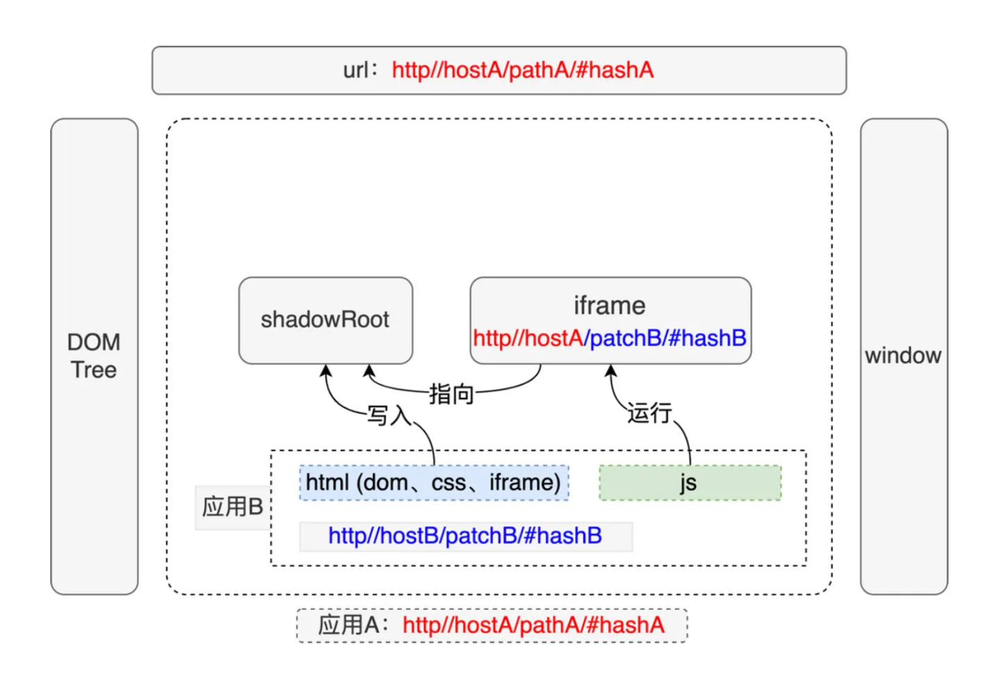
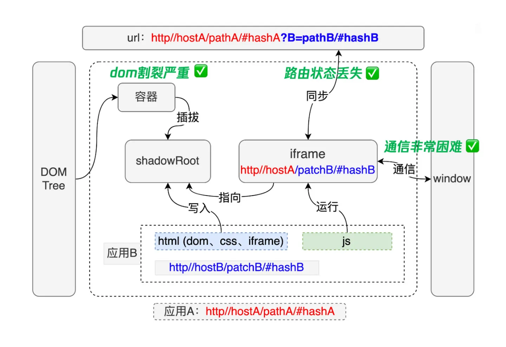
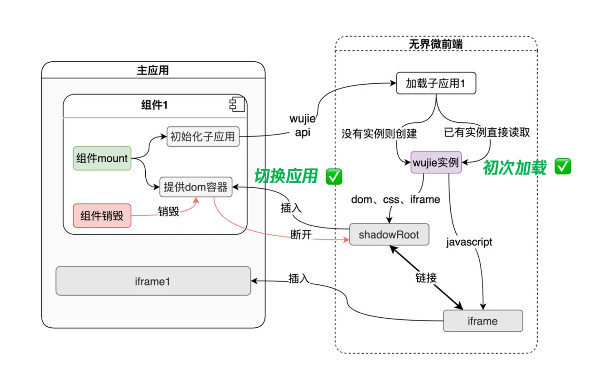

# Why 无界？

无界微前端框架通过继承 iframe 的优点，解决 iframe 的缺点，打造一个接近完美的 iframe 方案

> iframe 优点

1. 非常简单，使用没有任何心智负担
2. 隔离完美，无论是 js、css、dom 都完全隔离开来
3. 多应用激活，页面上可以摆放多个 iframe 来组合业务

> iframe 缺点

1. 路由状态丢失，刷新一下，iframe 的 url 状态就丢失了
2. dom 割裂严重，弹窗只能在 iframe 内部展示，无法覆盖全局
3. 通信非常困难，只能通过 postmessage 传递序列化的消息
4. 白屏时间太长，对于 SPA 应用来说无法接受

- 使用 Web Component + iframe 解决
  > <input> <video>等标签其实也是用了 shadowRoot

1. 在应用 A 中构造一个 **shadow** 和 iframe，然后将应用 B 的 html 写入 shadow 中，js 运行在 iframe 中，注意 iframe 的 url，iframe 保持和主应用同域但是保留子应用的路径信息，这样子应用的 js 可以运行在 iframe 的 location 和 history 中保持路由正确。
2. 在 iframe 中拦截 document 对象，统一将 dom 指向 shadowRoot，此时比如新建元素、弹窗或者冒泡组件就可以正常约束在 shadowRoot 内部。
   

**接下来的三步分别解决 iframe 的三个缺点：**

- ✅ dom 割裂严重的问题，主应用提供一个容器给到 shadowRoot 插拔，shadowRoot 内部的弹窗也就可以覆盖到整个应用 A
- ✅ 路由状态丢失的问题，浏览器的前进后退可以天然的作用到 iframe 上，此时监听 iframe 的路由变化并同步到主应用，如果刷新浏览器，就可以从 url 读回保存的路由
- ✅ 通信非常困难的问题，iframe 和主应用是同域的，天然的共享内存通信，而且无界提供了一个去中心化的事件机制

  > 什么是 Shadown DOM？Shadown DOM 属于 web components 技术中的一环，是一个极其关键的接口实现，Shadow DOM 接口可以将一个隐藏的、独立的 DOM 附加到一个元素上,操作 Shadown DOM 和操作普通 DOM 是一样的，Shadow DOM 内部可以添加任意 DOM 元素，Shadow DOM 内部的元素始终不会影响到它外部的元素（除了 :focus-within），例如添加 style 元素，只会对 Shadow DOM 内部元素生效。
  > 参考：https://juejin.cn/post/6979489951108825095

  

- ✅ 首次白屏的问题，wujie 实例可以提前实例化（预加载，RequestIdleCallback），包括 shadowRoot、iframe 的创建、js 的执行，这样极大的加快子应用第一次打开的时间
- ✅ 切换白屏的问题，一旦 wujie 实例可以缓存下来，子应用的切换成本变的极低，如果采用保活模式，那么相当于 shadowRoot 的插拔
  

由于子应用完全独立的运行在 iframe 内，路由依赖 iframe 的 location 和 history，我们还可以在一张页面上同时激活多个子应用，由于 iframe 和主应用处于同一个[top-level browsing context](https://developer.mozilla.org/zh-CN/docs/Glossary/Browsing_context)，因此浏览器前进、后退都可以作用到到子应用：

### 无界传参

1.我们之前讲过无界的架构子应用的 js 是存放在 iframe 的，既然是 iframe 就可以通过 window 进行通讯，

主应用定义一个全局变量

```js
var a = 'jy'
```

子应用通过 window.parent.a 就可以访问到

```javascript
const send = () => {
  console.log(alert(window.parent.a))
}
```

2.通过 props 给子应用注入参数

```xml
<WujieVue :props="{name:'jy',age:18}"  url="http://127.0.0.1:5174/" name="vue3"></WujieVue> <!--子应用vue3-->
```

子应用可以通过[$wujie](https://link.juejin.cn?target=https%3A%2F%2Fwujie-micro.github.io%2Fdoc%2Fapi%2Fwujie.html%23wujie-props)来获取：

```js
window.$wujie.props
```

如果报错$wujie 可以添加声明文件

```ts
declare global {
  interface Window {
    $wujie: {
      props: Record<string, any>
    }
  }
}
```

3.event bus

主应用通过 bus 监听

```js
import { bus } from 'wujie'
bus.$on('vue3', (data: any) => {
  console.log(data)
})
```

子应用通过 emit 触发事件（反之也可以 主应用 emit 触发子应用 on 监听）

```js
window.$wujie.bus.$emit('vue3', { name: 'jy', age: 18 })
```
